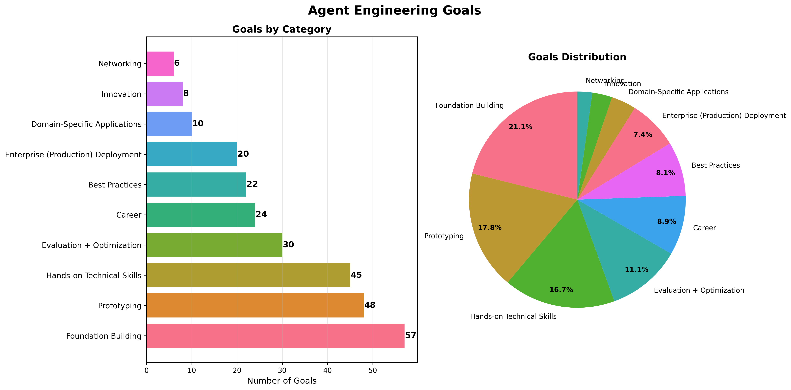

# Agent Engineering Goals

Students were asked to reflect on their goals for the course. Most of the reponses can be categorized into the following camps:



```py
Total participants: 96
Total category assignments: 292
Average categories per goal: 3.04

Category                            Count    Percentage
-------------------------------------------------------
Foundation Building                 62           64.6%
Prototyping                         54           56.2%
Hands-on Technical Skills           51           53.1%
Evaluation + Optimization           31           32.3%
Best Practices                      24           25.0%
Career                              24           25.0%
Enterprise (Production) Deployment  20           20.8%
Innovation                          10           10.4%
Domain-Specific Applications        10           10.4%
Networking                          6             6.2%
```

## Goal Categories

### Learning & Foundation Building
Goals focused on acquiring knowledge, understanding concepts, and building theoretical foundations in RL, MCP, and agent frameworks.

### Hands-on Technical Skills
Goals about gaining practical experience with specific technologies like GRPO, RL fine-tuning, MCP implementation, and agent development tools.

### Prototyping
Goals centered on building specific applications, shipping prototypes, and creating proof-of-concepts (POCs).

### Enterprise (Production) Deployment
Goals related to deploying agents in production environments, enterprise applications, and organizational adoption.

### Domain-Specific Applications
Goals targeting specific use cases like banking regulation, medical diagnosis, smart home automation, formal proof verification, etc.

### Best Practices & Decision Making
Goals about understanding when/how to use different approaches, design patterns, trade-offs, and architectural decisions.

### Evaluation & Optimization
Goals focused on building evaluation systems, reward models, feedback loops, and performance optimization.

### Networking & Collaboration
Goals about learning from peers, making connections, engaging in mutual projects, and community building.

### Career & Professional Development
Goals related to interview preparation, skill advancement for work roles, and professional growth.

### Innovation & Research
Goals about pushing boundaries, improving on existing research, and exploring cutting-edge applications.


## Installation

<details>
  <summary>Click to expand for installation instructions if you want to improve the script and run it yourself.</summary>

### Prerequisites
- Python 3.10 or later
- pip (Python package installer)

### Setup Instructions

1. **Create a virtual environment** (from the repository root):
   ```bash
   # Windows
   py -3.10 -m venv --prompt goalgraph venv
   
   # macOS/Linux
   python3.10 -m venv --prompt goalgraph venv
   ```

2. **Activate the virtual environment**:
   ```bash
   # Windows
   .\venv\Scripts\activate
   
   # macOS/Linux
   source venv/bin/activate
   ```

3. **Upgrade pip and install base packages**:
   ```bash
   python -m pip install --upgrade pip wheel setuptools
   ```

4. **Install required dependencies**:
   ```bash
   python -m pip install matplotlib seaborn pandas
   ```

### Running the Scripts

Once installed, you can run any of the analysis scripts from the repository root:

```bash
# Run goal categorization analysis
python sidequests/community-goals/goal_categorization.py

# Run goal extraction (if needed)
python sidequests/community-goals/goal_extraction.py
```

### Dependencies Installed

The installation will include:
- **matplotlib (3.10.3+)**: For creating visualizations and charts
- **seaborn (0.13.2+)**: For enhanced statistical plotting
- **pandas (2.3.0+)**: For data manipulation and analysis
- Additional dependencies: numpy, pillow, fonttools, and others as required
</details>