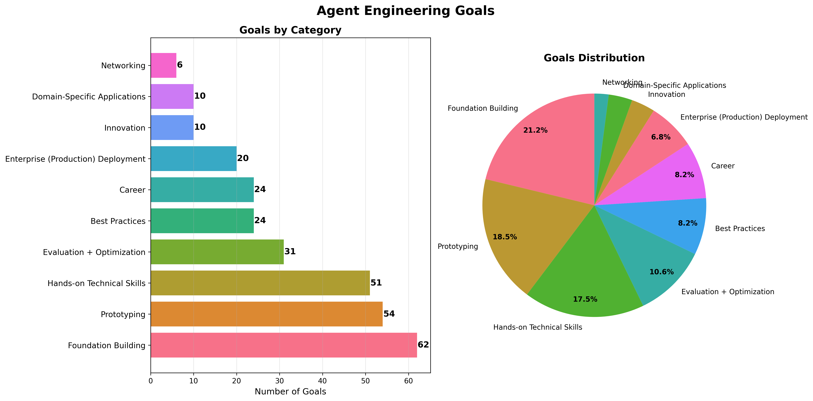

# Agent Engineering Goals

Students were asked to reflect on their goals for the course. Most of the reponses can be categorized into the following categories:

## Goal Categories for Sentiment Analysis

### Learning & Foundation Building
Goals focused on acquiring knowledge, understanding concepts, and building theoretical foundations in RL, MCP, and agent frameworks.

### Hands-on Technical Skills
Goals about gaining practical experience with specific technologies like GRPO, RL fine-tuning, MCP implementation, and agent development tools.

### Prototyping
Goals centered on building specific applications, shipping prototypes, and creating proof-of-concepts (POCs).

### Enterprise (Production) Deployment
Goals related to deploying agents in production environments, enterprise applications, and organizational adoption.

### Domain-Specific Applications
Goals targeting specific use cases like banking regulation, medical diagnosis, smart home automation, formal proof verification, etc.

### Best Practices & Decision Making
Goals about understanding when/how to use different approaches, design patterns, trade-offs, and architectural decisions.

### Evaluation & Optimization
Goals focused on building evaluation systems, reward models, feedback loops, and performance optimization.

### Networking & Collaboration
Goals about learning from peers, making connections, engaging in mutual projects, and community building.

### Career & Professional Development
Goals related to interview preparation, skill advancement for work roles, and professional growth.

### Innovation & Research
Goals about pushing boundaries, improving on existing research, and exploring cutting-edge applications.