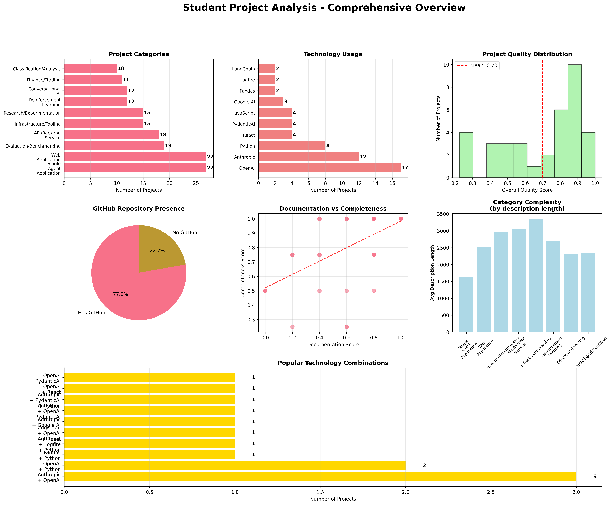

# Agent Engineering Projects

Students were assigned a protoyping project to submit demonstrating their understanding of the first week of topics.



```py
Total Projects: 30
Projects with GitHub: 23 (76.7%)
Average Quality Score: 0.72
Average Categories per Project: 5.4
Average Technologies per Project: 2.0

\Top Categories:
  Web Application: 22
  Single Agent Application: 21
  Evaluation/Benchmarking: 16
  API/Backend Service: 15
  Infrastructure/Tooling: 13

\Top Technologies:
  OpenAI: 17
  Anthropic: 12
  Python: 7
  PydanticAI: 4
  JavaScript: 3
```

## Installation

<details>
  <summary>Click to expand for installation instructions if you want to improve the script or run it yourself.</summary>

### Prerequisites
- Python 3.10 or later
- pip (Python package installer)

### Setup Instructions

1. **Create a virtual environment** (from the repository root):
   ```bash
   # Windows
   py -3.10 -m venv --prompt projectgraph venv
   
   # macOS/Linux
   python3.10 -m venv --prompt projectgraph venv
   ```

2. **Activate the virtual environment**:
   ```bash
   # Windows
   .\venv\Scripts\activate
   
   # macOS/Linux
   source venv/bin/activate
   ```

3. **Upgrade pip and install base packages**:
   ```bash
   python -m pip install --upgrade pip wheel setuptools
   ```

4. **Install required dependencies**:
   ```bash
   python -m pip install matplotlib seaborn pandas
   ```

### Running the Scripts

Once installed, you can run any of the analysis scripts from the repository root:

```bash
# Run goal extraction
python sidequests/community-projects/project_extraction.py
```

### Dependencies Installed

The installation will include:
- **matplotlib (3.10.3+)**: For creating visualizations and charts
- **seaborn (0.13.2+)**: For enhanced statistical plotting
- **pandas (2.3.0+)**: For data manipulation and analysis
- Additional dependencies: numpy, pillow, fonttools, and others as required
</details>