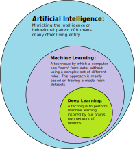

# Mapping Reinforcement Learning

In my effort to visualize where reinforcement learning falls in the landscape of AI, I've come across a few images on Wikipedia:
- [Reinforcement learning](https://en.wikipedia.org/wiki/Reinforcement_learning)
- [Deep learning](https://en.wikipedia.org/wiki/Deep_learning)
- [Machine learning](https://en.wikipedia.org/wiki/Machine_learning)
- [Artificial intelligence](https://en.wikipedia.org/wiki/Artificial_intelligence)

These two graphs are most useful to me:

 

This is about as far as I made it in designing my own graphic before I realized the field deserves deeper research:

Which prompted my brain to generate more questions:
- How is deep learning different from reinforcement learning if both are apart of machine learning?
- Is training a large language model supervised or unsupervised learning? Both? Does the answer change if it's fine tuning vs pretraining?
- How active is the field of deep learning, is it actively being developed? By whom? Should it be given more or less weight than the ML approaches?

I get the feeling these things are not clearly defined. Or maybe just a skill issue on my part.
Don't have enough time for a full sidequest but thinking of everything as a mindmap helps me understand the relationships at play.

## Update

I asked o3 to give me its take on the field given the context of the problem and my design. It generated this:

Not sure how accurate this is but I think it's amazing models are able to do things like this.